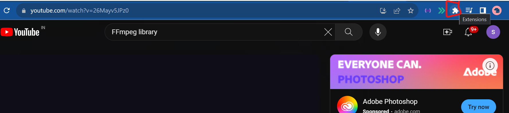
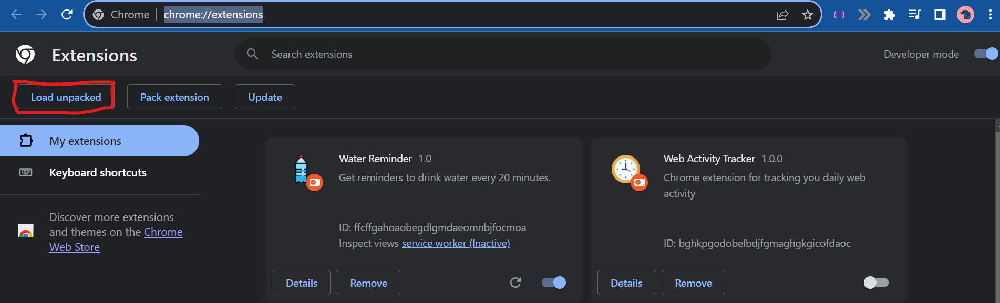

Download the repository with git clone or just zip...

Go to manage extension OR in address bar type ( chrome://extensions/)

Click on Load unpacked

Select the downloaded repository/folder

Enjoy the next ♾️ minutes of ad-free experience 👍
